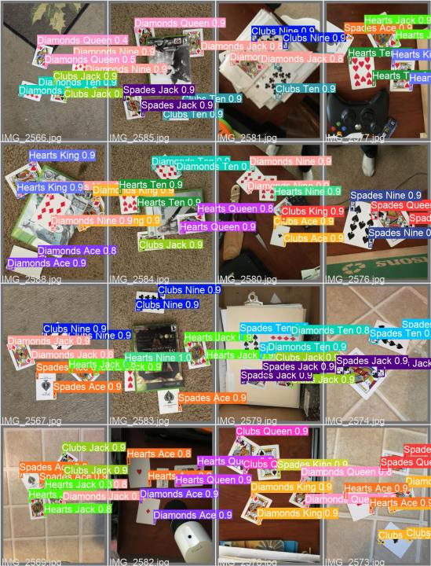
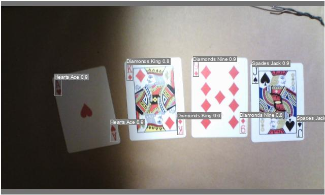

这是一个检测扑克牌的代码，基于yolov5进行预训练，总共52*4+2类 (包含大小王)

训练：
    python3 train.py
    
使用首先需要对anchor用kmeans算法得出适合本数据集最佳的宽与高 本代码后续会提供在芯片上部署的方法 
 

1.提供pt转pth工具 

2.提供tvm加载onnx模型的脚本以及tvm的配置与改进的方法 

3.提供c++代码加载模型的方法